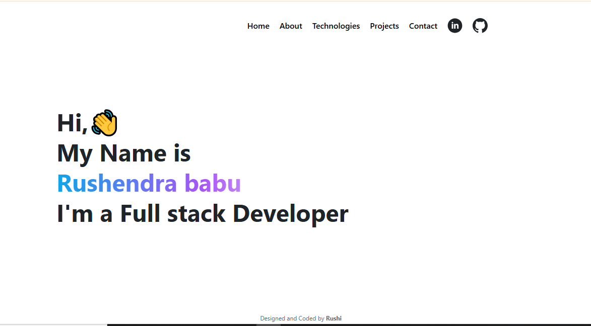

# 🚀 Portfolio Website using React.js

This is a responsive and interactive **Portfolio Website** built with **React.js** to showcase my personal projects, skills, and experience as a Full Stack Developer.  
The application is designed with clean UI/UX, reusable components, and smooth navigation to provide an engaging user experience.

---

## ✨ Features
- 📱 **Responsive Design** – Works on desktop, tablet, and mobile devices  
- ⚛️ **Built with React.js** – Component-based architecture  
- 🎨 **Modern UI/UX** – Styled with CSS and Bootstrap  
- 🔗 **Projects Showcase** – Highlights personal projects with images and descriptions  
- 📂 **Reusable Components** – Easy to extend and maintain  
- 🌍 **Deployed Online** – Publicly accessible for recruiters and clients  

---

## 🛠️ Technologies Used
- **Frontend**: React.js, JavaScript, HTML5, CSS3, Bootstrap  
- **Deployment**: Netlify  

---

## 📸 Screenshots
### Home Page

### Projects Section

---

## 🚀 Deployment
This project is deployed on **Netlify**.  
🔗 [Live Demo](https://rushendra-babu-portfolio.netlify.app/)

---

## 📂 Installation & Setup

1. Clone the repository:
  
git clone https://github.com/yourusername/portfolio-website.git

2. Navigate to the project folder:

cd portfolio-website

3. Install dependencies:

npm install

4. Start development server:

npm start

⭐ If you like this project, feel free to fork, contribute, or give it a star!

yaml
Copy
Edit
